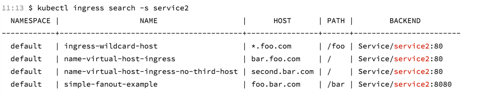
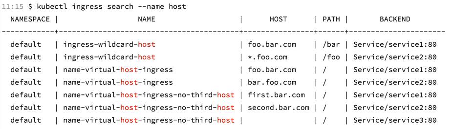
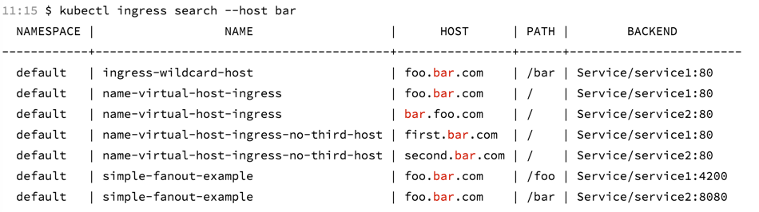
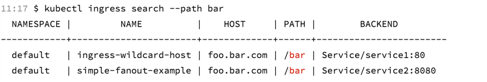
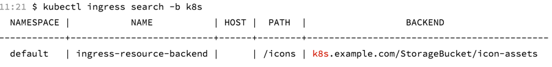
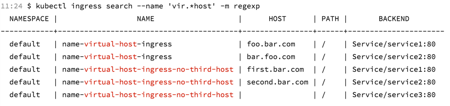

# kubectl-ingress-search

Search Ingress resources.


## Install

1. Download from release page.
2. cp kubectl-ingress-search /usr/local/bin/

## Usage

list all ingress in default namespace:

```
$ kubectl ingress search
  NAMESPACE |                  NAME                   |         HOST          |   PATH    |                  BACKEND                   
------------+-----------------------------------------+-----------------------+-----------+--------------------------------------------
  default   | ingress-resource-backend                |                       | /icons    | k8s.example.com/StorageBucket/icon-assets  
  default   | ingress-wildcard-host                   | foo.bar.com           | /bar      | Service/service1:80                        
  default   | ingress-wildcard-host                   | *.foo.com             | /foo      | Service/service2:80                        
  default   | minimal-ingress                         |                       | /testpath | Service/test:80                            
  default   | name-virtual-host-ingress               | foo.bar.com           | /         | Service/service1:80                        
  default   | name-virtual-host-ingress               | bar.foo.com           | /         | Service/service2:80                        
  default   | name-virtual-host-ingress-no-third-host | first.bar.com         | /         | Service/service1:80                        
  default   | name-virtual-host-ingress-no-third-host | second.bar.com        | /         | Service/service2:80                        
  default   | name-virtual-host-ingress-no-third-host |                       | /         | Service/service3:80                        
  default   | simple-fanout-example                   | foo.bar.com           | /foo      | Service/service1:4200                      
  default   | simple-fanout-example                   | foo.bar.com           | /bar      | Service/service2:8080                      
  default   | tls-example-ingress                     | https-example.foo.com | /         | Service/service1:80                        
```

### by namespace

```
$ kubectl ingress search -n test
  NAMESPACE |      NAME       | HOST |   PATH    |     BACKEND      
------------+-----------------+------+-----------+------------------
  test      | minimal-ingress |      | /testpath | Service/test:80  
```

### by service

```
$ kubectl ingress search -s service2
```


### by name

```
$ kubectl ingress search --name host
```


### by host

```
$ kubectl ingress search --host bar
```


### by path

```
$ kubectl ingress search --path bar
```


### by backend

```
$ kubectl ingress search -b k8s
```


### regexp

```
$ kubectl ingress search --name 'vir.*host' -m regexp
```


### auto merge

```
$ kubectl ingress search --auto-merge --host foo.bar
+-----------+---------------------------+-------------+------+-----------------------+
| NAMESPACE |           NAME            |    HOST     | PATH |        BACKEND        |
+-----------+---------------------------+-------------+------+-----------------------+
| default   | ingress-wildcard-host     | foo.bar.com | /bar | Service/service1:80   |
+           +---------------------------+             +------+                       +
|           | name-virtual-host-ingress |             | /    |                       |
+           +---------------------------+             +------+-----------------------+
|           | simple-fanout-example     |             | /foo | Service/service1:4200 |
+           +                           +             +------+-----------------------+
|           |                           |             | /bar | Service/service2:8080 |
+-----------+---------------------------+-------------+------+-----------------------+
```

### options

```
$ ./kubectl-ingress-search -h
kubectl-ingress-search search Ingress resources to match given pattern(s).
It prints matched Ingress in table format.
More info: https://github.com/mozilazg/kubectl-ingress-search

Usage:
  kubectl-ingress-search [flags]

Examples:

$ kubectl ingress search
$ kubectl ingress search --service test
$ kubectl ingress search --name test
$ kubectl ingress search --host example.com
$ kubectl ingress search --path /test
$ kubectl ingress search --no-header
$ kubectl ingress search --match-mode exact
$ kubectl ingress search --match-mode regexp
$ kubectl ingress search --case-sensitive


Flags:
  -A, --all-namespaces                if present, list the requested object(s) across all namespaces. Namespace in current context is ignored even if specified with --namespace
      --auto-merge                    auto merge table cells
  -b, --backend string                search by backend
  -I, --case-sensitive                case sensitive pattern match
  -h, --help                          help for kubectl-ingress-search
  -H, --highlight-duplicate-service   highlight duplicate service
      --host string                   search by host
      --kubeconfig string             path to the kubeconfig file to use for CLI requests
  -m, --match-mode string             exact match or regexp match. One of (exact|regexp) (default "exact")
      --name string                   search by name
  -n, --namespace string              if present, the namespace scope for this CLI request (default "default")
      --no-header                     don't show table header
  -p, --path string                   search by path
  -s, --service string                search by service
```
